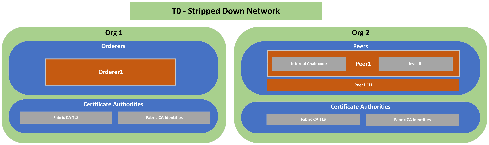

# T0: Stripped Network
## Description
---
A basic network with two organizations: one for the orderer and one with a peer. This topology is a stripped down version of T1, created mostly for understanding one the most basic fabric network setups.
## Diagram
---

## Components List
---
* Org 1
  * Orderer 1
  * TLS CA
  * Identities CA
* Org 2
  * Peer 1
  * TLS CA
  * Identities CA
  * Peer 1 CLI

## Characteristics

- World State Database Instance (LevelDB) embedded (in peer containers) 
- Chaincode installed directly on peers
- Communication between all components done via TLS