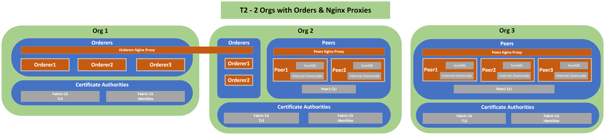

# T2: More orderers and peers
## Description
---
T1 plus additional orderers and peers. Nginx Proxies are setup in front of the Peers and Orderers. Communication from client applications to execute chaincode is done via the Proxies vs direct access to peer or orderer nodes. The proxies are also used for some of the lifecycle operations (approve, commit chaincode)
## Diagram
---

## Components List
---
* Org 1
  * Orderer 1
  * Orderer 2
  * Orderer 3
  * TLS CA
  * Identities CA
* Org 2
  * Orderer 1
  * Orderer 2
  * Peer 1
  * Peer 1 CLI
  * Peer 2
  * Peers Proxy (load balances between Org 1 Peer 1 and Org 1 Peer 2)
  * TLS CA
  * Identities CA
* Org 3
  * Peer 1
  * Peer 1 CLI
  * Peer 2
  * Peer 3
  * Peers Proxy (load balances between Org 2 Peer 1, Org 2 Peer 2 and Org 2 Peer 3
  * TLS CA
  * Identities CA
* Orderers Proxy (load balances across all Orderers: Org 1 Orderer 1-3 and Org 2 Orderer 1-2)

## Characteristics

- World State Database Instance (LevelDB) embedded (in peer containers)
- Chaincode installed directly on peers
- Communication between all components done via TLS