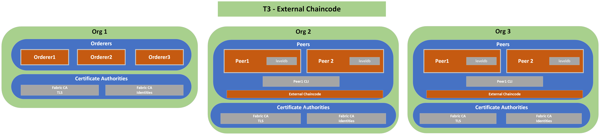

# T3: External chaincode
## Description
---
T1 Network plus external chaincode server for each org that has peers
## Diagram
---

## Relevant Documentation

- https://hyperledger-fabric.readthedocs.io/en/latest/cc_service.html

## Components List
---
* Org 1
  * Orderer 1
  * Orderer 2
  * Orderer 3
  * TLS CA
  * Identities CA
* Org 2
  * Peer 1
  * Peer 1 CLI
  * Peer 2
  * External Chaincode Server
  * TLS CA
  * Identities CA
* Org 3
  * Peer 1
  * Peer 1 CLI
  * Peer 2
  * External Chaincode Server
  * TLS CA
  * Identities CA
  
## Characteristics

- World State Database Instance (LevelDB) embedded (in peer containers)
- Chaincode running as a container, external to peers. Chaincode installation on peers involves moslty a shim, a way to establish a connection to the external server. For each org the communication between peers and the chaincode sever is done via TLS.
- Communication between all components done via TLS