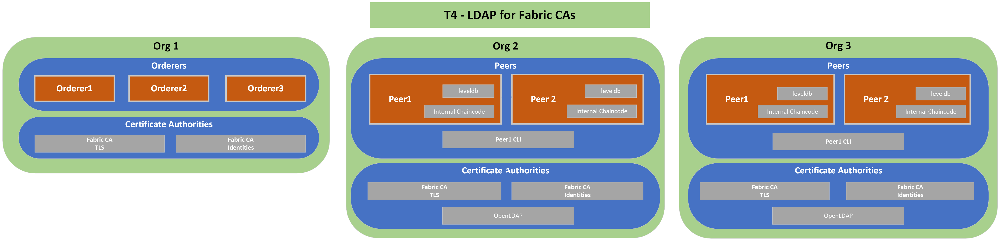

# T4: LDAP for Credentials Store
## Description
---
T1 Network plus OpenLDAP server where Identities (user/passwords) are read from  to authenticate enrollment requests
## Diagram
---

## Relevant Documentation

- https://hyperledger-fabric-ca.readthedocs.io/en/release-1.4/users-guide.html#configuring-ldap

## Components List
---
* Org 1
  * Orderer 1
  * Orderer 2
  * Orderer 3
  * TLS CA
  * Identities CA
  * OpenLDAP
* Org 2
  * Peer 1
  * Peer 1 CLI
  * Peer 2
  * TLS CA
  * Identities CA
  * OpenLDAP
* Org 3
  * Peer 1
  * Peer 1 CLI
  * Peer 2
  * TLS CA
  * Identities CA
  * OpenLDAP
  
## Characteristics

- World State Database Instance (LevelDB) embedded (in peer containers)
- Chaincode installed directly on peers
- Communication between all components done via TLS