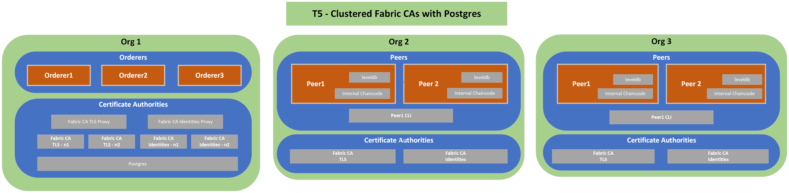

# T5: Postgres for CA Clustering
## Description
---
T1 Network plus a Postgres DB per instance to store identities and certs issued by the Fabric CA. Multiple Fabric CAs working a cluster with Postgres as the backend. This applies to the Org 1 only.

## Diagram
---

## Relevant Documentation

- https://hyperledger-fabric-ca.readthedocs.io/en/release-1.4/users-guide.html#configuring-the-database
- https://hyperledger-fabric-ca.readthedocs.io/en/release-1.4/users-guide.html#setting-up-a-cluster

## Components List
---
* Org 1
  * Orderer 1
  * Orderer 2
  * Orderer 3
  * TLS CA - 2 nodes
  * Identities CA - 2 nodes
  * Postgres
* Org 2
  * Peer 1
  * Peer 1 CLI
  * Peer 2
  * TLS CA
  * Identities CA
* Org 3
  * Peer 1
  * Peer 1 CLI
  * Peer 2
  * TLS CA
  * Identities CA
  
## Characteristics

- World State Database Instance (LevelDB) embedded (in peer containers)
- Chaincode installed directly on peers
- Communication between all components done via TLS