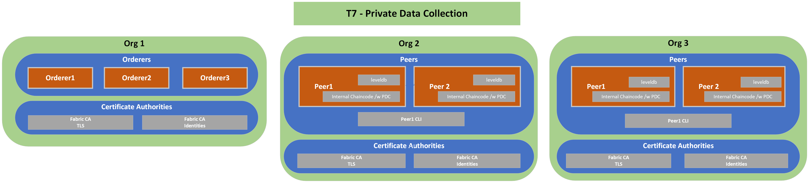

# T7: Private Data Collection
## Description
---
T1 network + usages of a Private Data Collection (PDC) for the test chaincode. The test chaincode is adapted to write to the PDC.

## Diagram
---

## Relevant Documentation

- https://hyperledger-fabric.readthedocs.io/en/latest/private-data/private-data.html

## Components List
---
* Org 1
  * Orderer 1
  * Orderer 2
  * Orderer 3
  * TLS CA
  * Identities CA
* Org 2
  * Peer 1
  * Peer 1 CLI
  * Peer 2
  * TLS CA
  * Identities CA
* Org 3
  * Peer 1
  * Peer 1 CLI
  * Peer 2
  * TLS CA
  * Identities CA
  
## Characteristics

- World State Database Instance (LevelDB) embedded (in peer containers)
- Chaincode installed directly on peers with a Private Data Collection
- Communication between all components done via TLS 