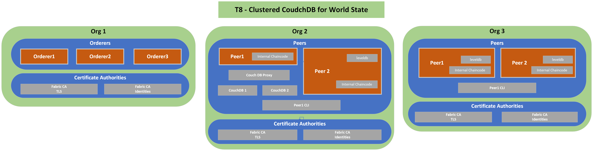

# T8: Clustered CouchdDB for World State
## Description
---
T1 network + 2 node CouchDB cluster for world state DB for Org 2 Peer 1. Please not that the docker-compose.yml at the top of this topology folder has ports enable for the 2 CouchDB nodes to be exposed to the nodes. This allows one to access the CouchDB admin console at these 2 URLs, once this network topology is up and running:

- http://localhost:5986/_utils/#
- http://localhost:5987/_utils/#

The login credentials can be found in the topologies/t8/containers/peers/org2-peers/docker-compose-org2-couchdb.yml

## Diagram
---

## Relevant Documentation

- https://hyperledger-fabric.readthedocs.io/en/latest/couchdb_tutorial.html
- https://docs.couchdb.org/en/3.2.2-docs/setup/cluster.html#the-cluster-setup-api

## Components List
---
* Org 1
  * Orderer 1
  * Orderer 2
  * Orderer 3
  * TLS CA
  * Identities CA
* Org 2
  * Peer 1
  * Peer 1 CLI
  * Peer 2
  * TLS CA
  * Identities CA
* Org 3
  * Peer 1
  * Peer 1 CLI
  * Peer 2
  * TLS CA
  * Identities CA
  
## Characteristics

- World State Database Instance (LevelDB) embedded (in peer containers) for all peers except Org 2 Peer 1
- Chaincode installed directly on peers with a Private Data Collection
- Communication between all components done via TLS 